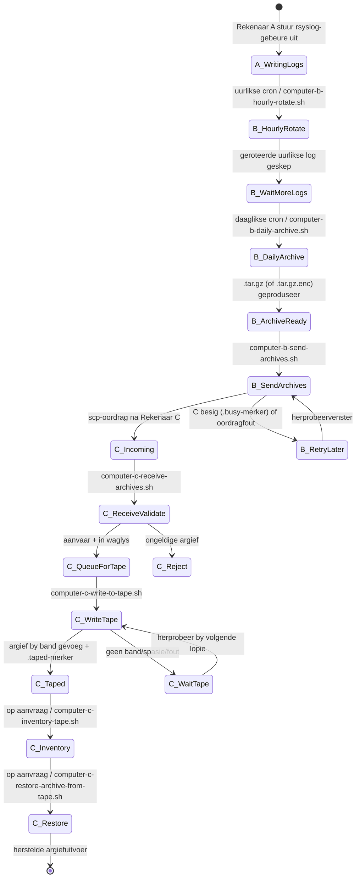
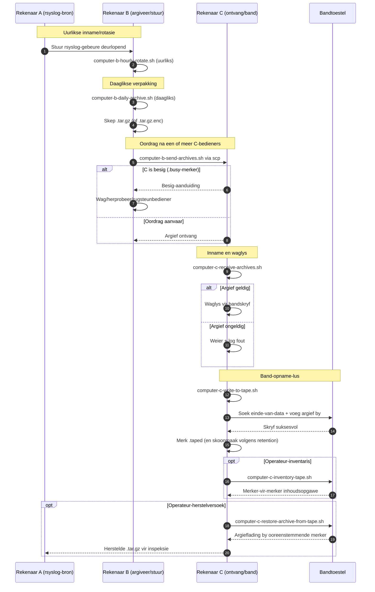

# A/B/C Pyplyn Diagramme (Afrikaans)

[← README (Afrikaans)](../README.af.md)

Hierdie gelokaliseerde kopie koppel die pyplyndiagramme aan die ooreenstemmende gelokaliseerde README.

## Gebeurtenis-toestanddiagram

## Volgordediagram

[← README (Afrikaans)](../README.af.md)
