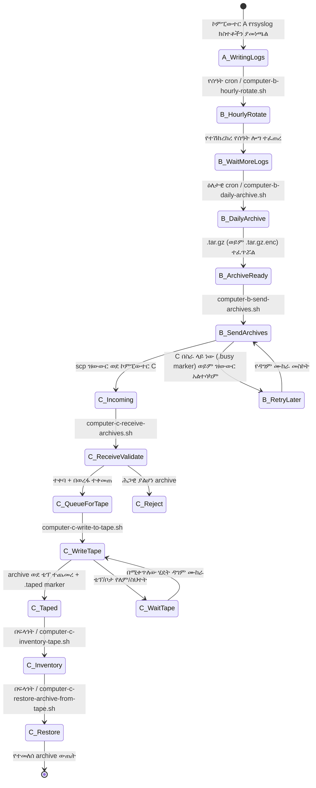
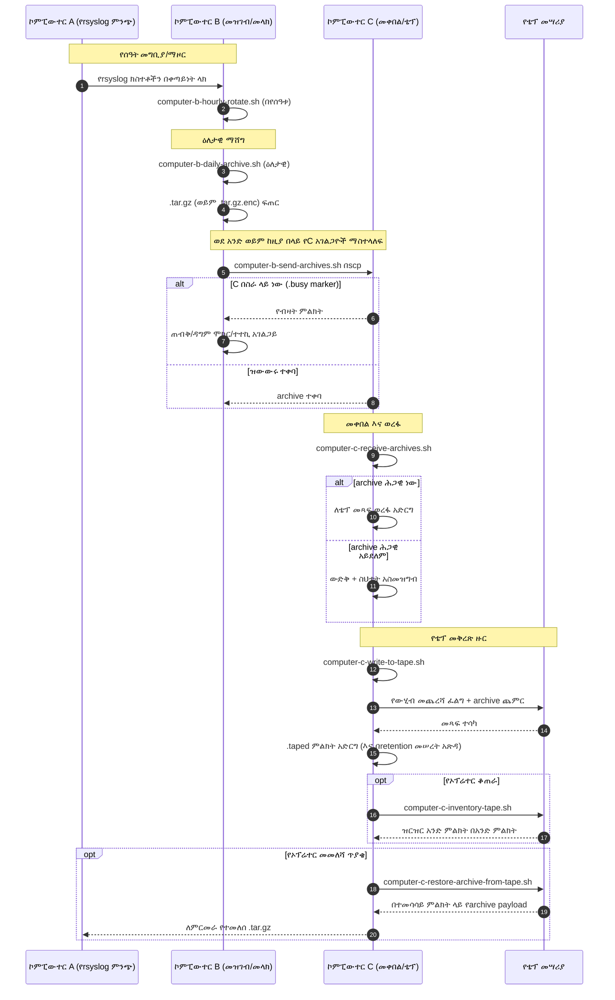

# የA/B/C ፓይፕላይን ንድፎች (አማርኛ)

[← README (አማርኛ)](../README.am.md)

ይህ የተተረጎመ ቅጂ የፓይፕላይን ንድፎችን ከተዛማጅ የተተረጎመ README ጋር ያገናኛል።

## የክስተት ሁኔታ ንድፍ

```mermaid
stateDiagram-v2
    [*] --> A_WritingLogs : ኮምፒውተር A የrsyslog ክስተቶችን ያመነጫል

    A_WritingLogs --> B_HourlyRotate : የሰዓት cron / computer-b-hourly-rotate.sh
    B_HourlyRotate --> B_WaitMoreLogs : የተሽከረከረ የሰዓት ሎግ ተፈጠረ
    B_WaitMoreLogs --> B_DailyArchive : ዕለታዊ cron / computer-b-daily-archive.sh
    B_DailyArchive --> B_ArchiveReady : .tar.gz (ወይም .tar.gz.enc) ተፈጥሯል

    B_ArchiveReady --> B_SendArchives : computer-b-send-archives.sh
    B_SendArchives --> C_Incoming : scp ዝውውር ወደ ኮምፒውተር C
    B_SendArchives --> B_RetryLater : C በስራ ላይ ነው (.busy marker) ወይም ዝውውር አልተሳካም
    B_RetryLater --> B_SendArchives : የዳግም ሙከራ መስኮት

    C_Incoming --> C_ReceiveValidate : computer-c-receive-archives.sh
    C_ReceiveValidate --> C_QueueForTape : ተቀባ + በወረፋ ተቀመጠ
    C_ReceiveValidate --> C_Reject : ሕጋዊ ያልሆነ archive

    C_QueueForTape --> C_WriteTape : computer-c-write-to-tape.sh
    C_WriteTape --> C_Taped : archive ወደ ቴፕ ተጨመረ + .taped marker
    C_WriteTape --> C_WaitTape : ቴፕ/ቦታ የለም/ስህተት
    C_WaitTape --> C_WriteTape : በሚቀጥለው ሂደት ዳግም ሙከራ

    C_Taped --> C_Inventory : በፍላጎት / computer-c-inventory-tape.sh
    C_Inventory --> C_Restore : በፍላጎት / computer-c-restore-archive-from-tape.sh
    C_Restore --> [*] : የተመለሰ archive ውጤት
```

## የቅደም ተከተል ንድፍ

```mermaid
sequenceDiagram
    autonumber
    participant A as ኮምፒውተር A (የrsyslog ምንጭ)
    participant B as ኮምፒውተር B (መዝገብ/መላክ)
    participant C as ኮምፒውተር C (መቀበል/ቴፕ)
    participant T as የቴፕ መሣሪያ

    Note over A,B: የሰዓት መግቢያ/ማዞር
    A->>B: የrsyslog ክስተቶችን በቀጣይነት ላክ
    B->>B: computer-b-hourly-rotate.sh (በየሰዓቱ)

    Note over B: ዕለታዊ ማሸግ
    B->>B: computer-b-daily-archive.sh (ዕለታዊ)
    B->>B: .tar.gz (ወይም .tar.gz.enc) ፍጠር

    Note over B,C: ወደ አንድ ወይም ከዚያ በላይ የC አገልጋዮች ማስተላለፍ
    B->>C: computer-b-send-archives.sh በscp
    alt C በስራ ላይ ነው (.busy marker)
        C-->>B: የብዛት ምልክት
        B->>B: ጠብቅ/ዳግም ሞክር/ተተኪ አገልጋይ
    else ዝውውሩ ተቀባ
        C-->>B: archive ተቀባ
    end

    Note over C: መቀበል እና ወረፋ
    C->>C: computer-c-receive-archives.sh
    alt archive ሕጋዊ ነው
        C->>C: ለቴፕ መጻፍ ወረፋ አድርግ
    else archive ሕጋዊ አይደለም
        C->>C: ውድቅ + ስህተት አስመዝግብ
    end

    Note over C,T: የቴፕ መቅረጽ ዙር
    C->>C: computer-c-write-to-tape.sh
    C->>T: የውሂብ መጨረሻ ፈልግ + archive ጨምር
    T-->>C: መጻፍ ተሳካ
    C->>C: .taped ምልክት አድርግ (እና በretention መሠረት አጽዳ)

    opt የኦፕሬተር ቆጠራ
        C->>T: computer-c-inventory-tape.sh
        T-->>C: ዝርዝር አንድ ምልክት በአንድ ምልክት
    end

    opt የኦፕሬተር መመለሻ ጥያቄ
        C->>T: computer-c-restore-archive-from-tape.sh
        T-->>C: በተመሳሳይ ምልክት ላይ የarchive payload
        C-->>A: ለምርመራ የተመለሰ .tar.gz
    end
```

[← README (አማርኛ)](../README.am.md)
