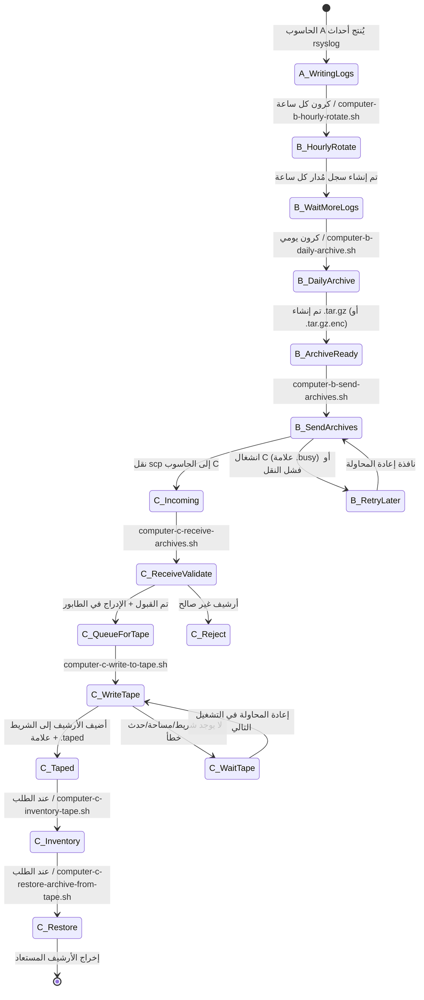
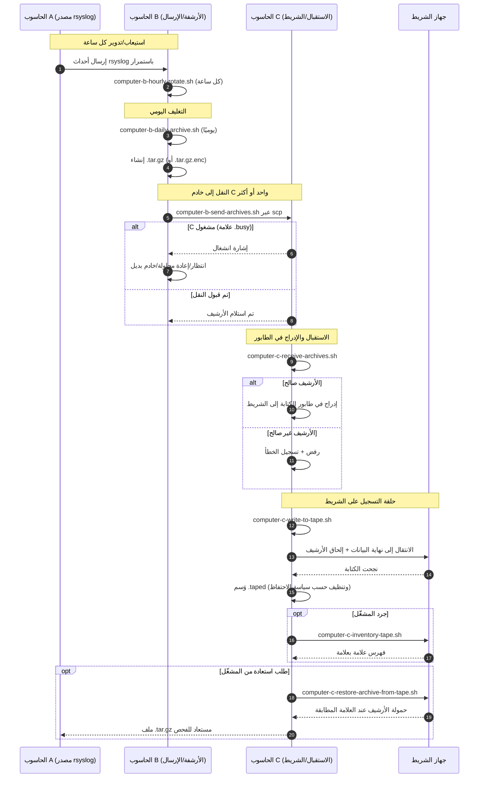

# مخططات خط أنابيب A/B/C (العربية)

[← README (العربية)](../README.ar.md)

تربط هذه النسخة المترجمة مخططات خط الأنابيب بملف README المترجم المقابل.

## مخطط حالة الأحداث

## مخطط التسلسل

[← README (العربية)](../README.ar.md)
