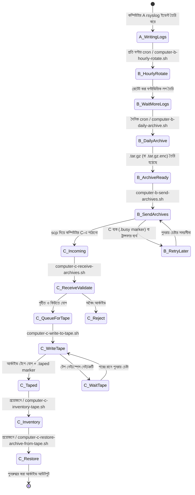
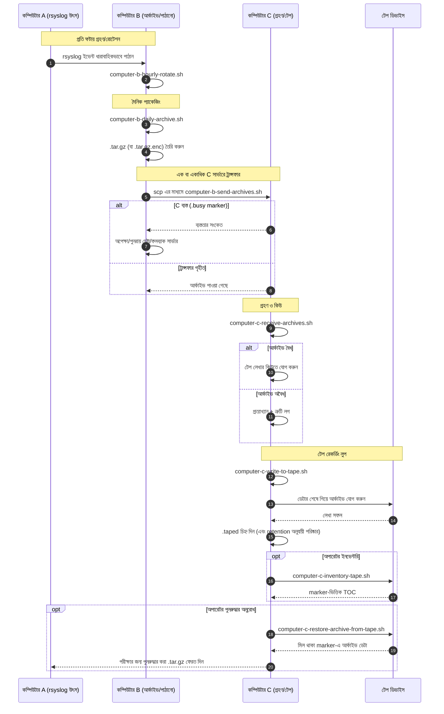

# A/B/C Pipeline Diagrams (বাংলা)

[← README (বাংলা)](../README.bn.md)

এই স্থানীয়কৃত কপিটি পাইপলাইন ডায়াগ্রামগুলোকে সংশ্লিষ্ট স্থানীয়কৃত README-এর সাথে যুক্ত করে।

## ইভেন্ট স্টেট ডায়াগ্রাম

## সিকোয়েন্স ডায়াগ্রাম

[← README (বাংলা)](../README.bn.md)
