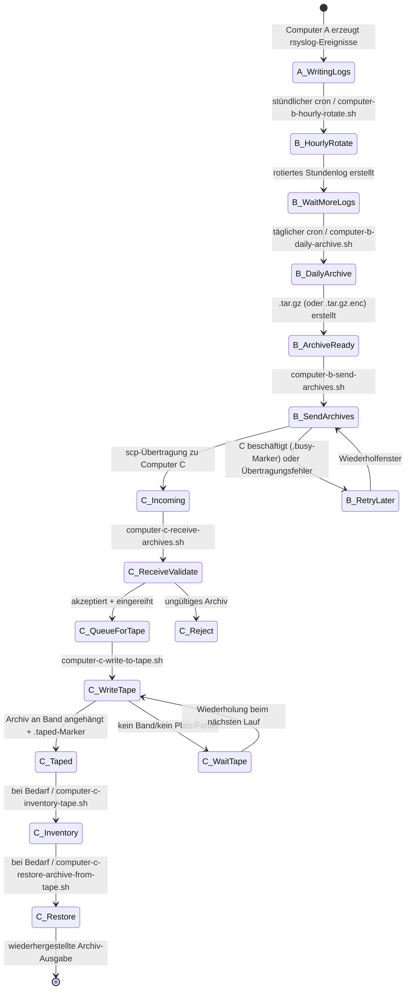
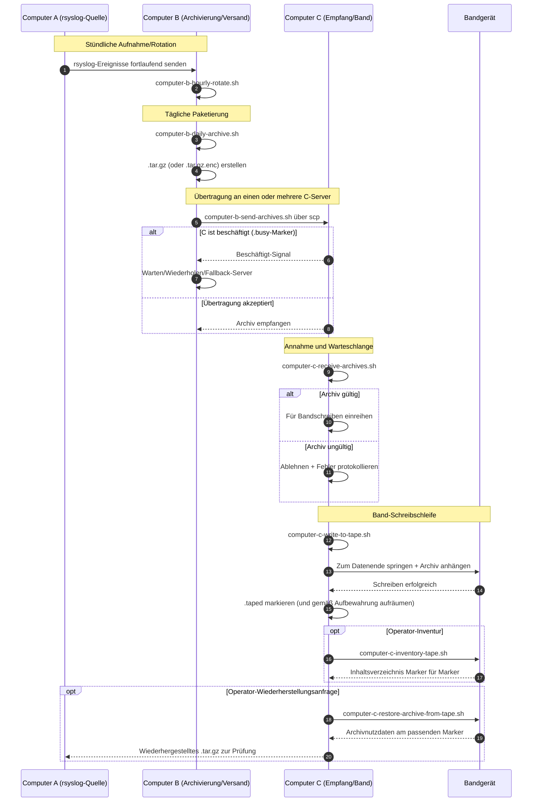

# A/B/C Pipeline Diagrams (Deutsch)

[← README (Deutsch)](../README.de.md)

Diese lokalisierte Version verknüpft die Pipeline-Diagramme mit der entsprechenden lokalisierten README.

## Ereignis-Zustandsdiagramm

## Sequenzdiagramm

[← README (Deutsch)](../README.de.md)
