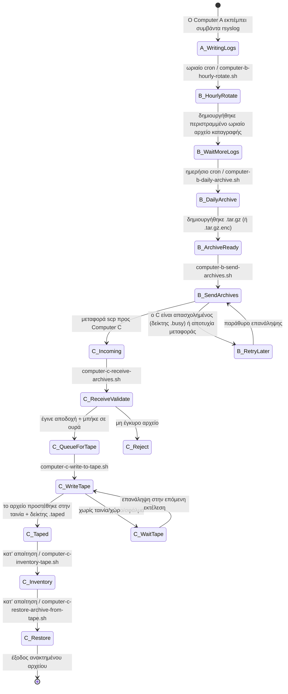
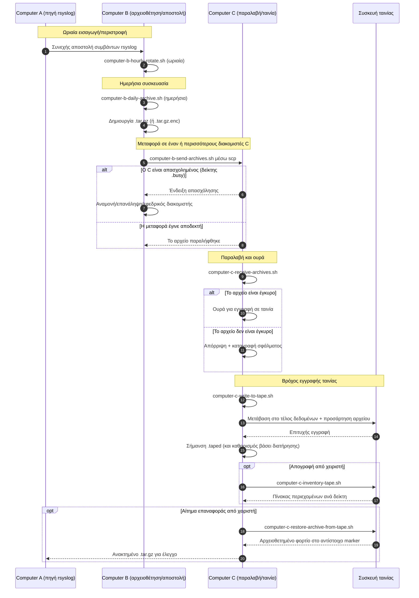

# Διαγράμματα pipeline A/B/C (Ελληνικά)

[← README (Ελληνικά)](../README.el.md)

Αυτό το μεταφρασμένο αντίγραφο συνδέει τα διαγράμματα pipeline με το αντίστοιχο μεταφρασμένο README.

## Διάγραμμα καταστάσεων συμβάντων

## Διάγραμμα ακολουθίας

[← README (Ελληνικά)](../README.el.md)
