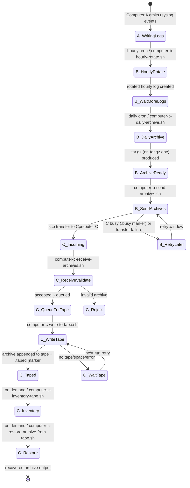
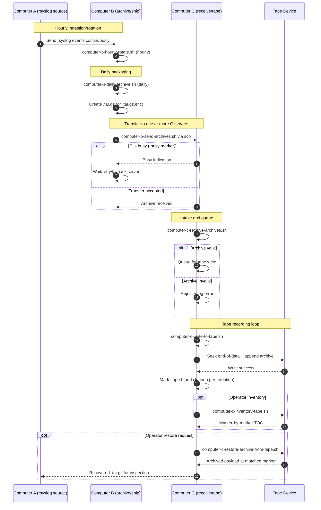

# A/B/C Pipeline Diagrams (US English)

[← README (US English)](../README.en-US.md)

This localized copy links the pipeline diagrams to the corresponding localized README.

## Event State Diagram

## Sequence Diagram

[← README (US English)](../README.en-US.md)
