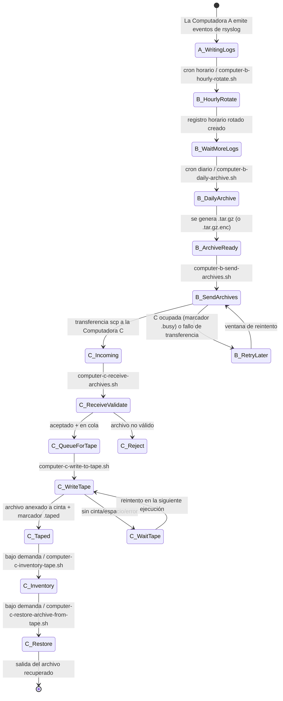
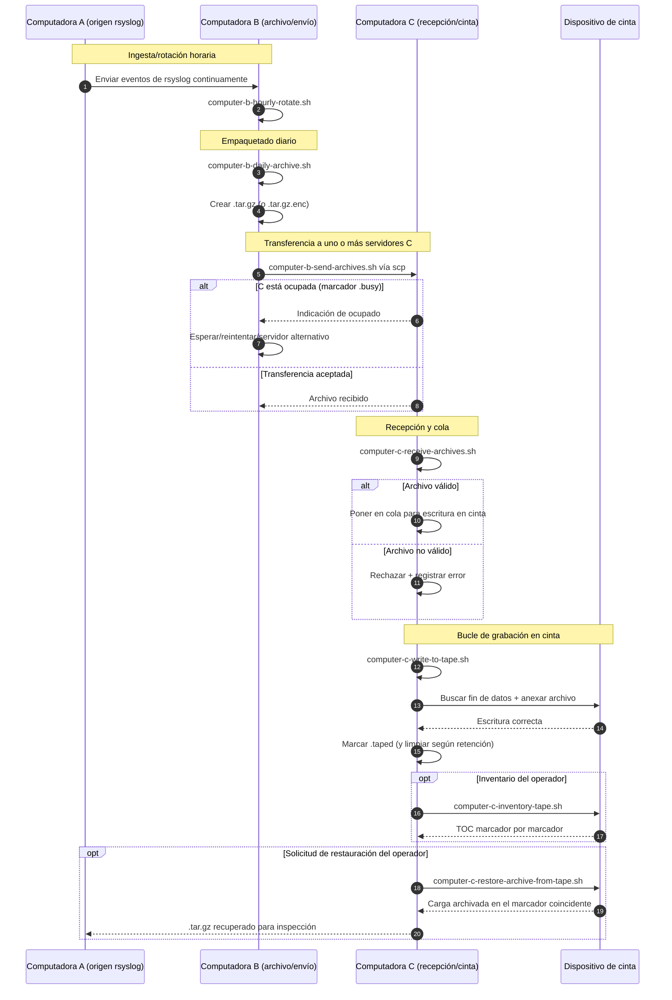

# A/B/C Pipeline Diagrams (Español)

[← README (Español)](../README.es.md)

Esta copia localizada vincula los diagramas de la canalización con el README localizado correspondiente.

## Diagrama de estados de eventos

## Diagrama de secuencia

[← README (Español)](../README.es.md)
