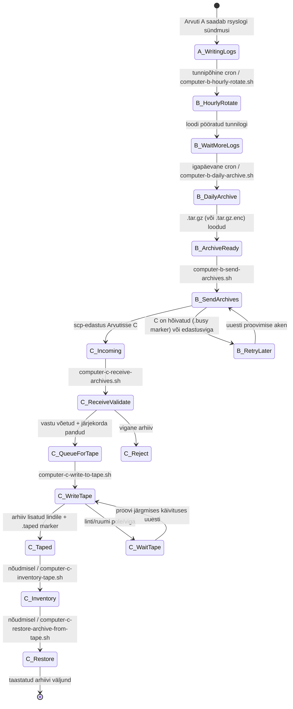
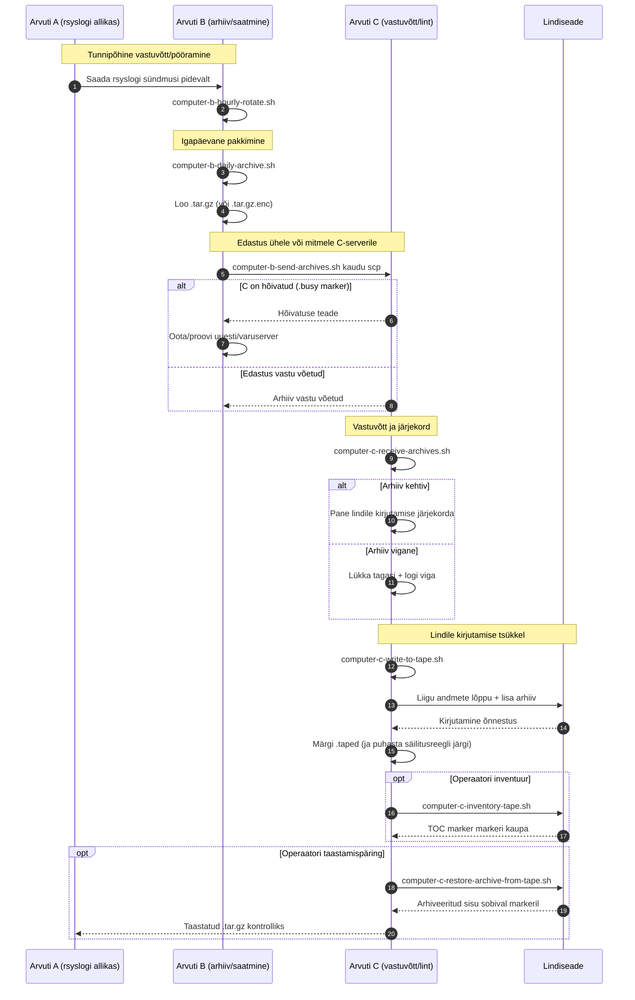

# A/B/C Pipeline Diagrams (Eesti)

[← README (Eesti)](../README.et.md)

See lokaliseeritud koopia seob torujuhtme diagrammid vastava lokaliseeritud README-ga.

## Sündmuste olekudiagramm

## Järjestusdiagramm

[← README (Eesti)](../README.et.md)
