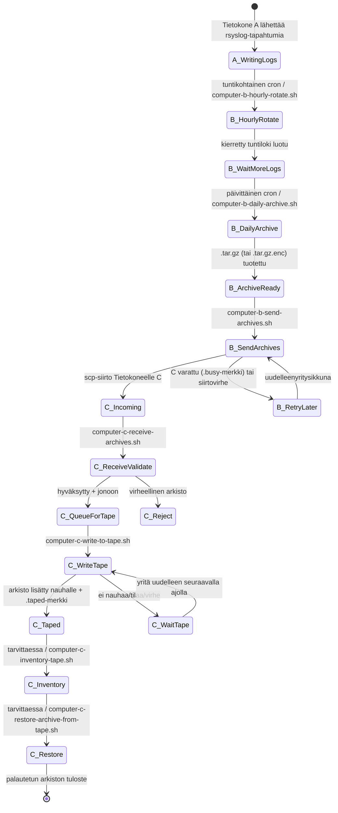
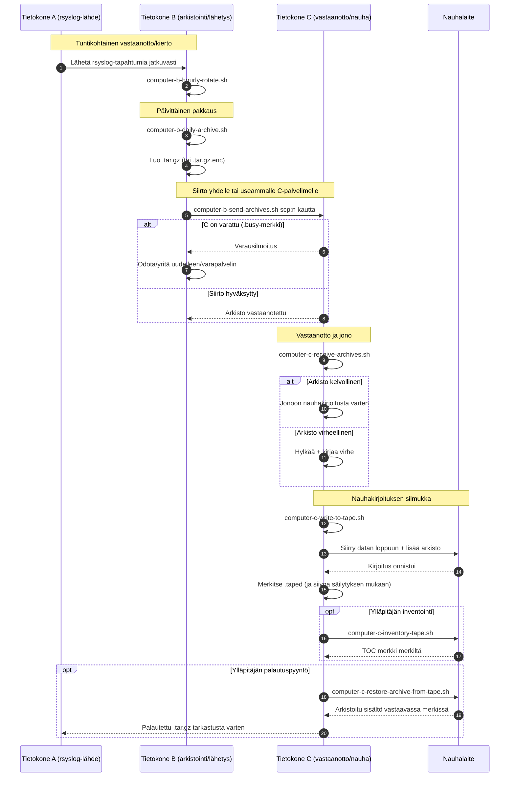

# A/B/C Pipeline Diagrams (Suomi)

[← README (Suomi)](../README.fi.md)

Tämä lokalisoitu kopio yhdistää putkistokaaviot vastaavaan lokalisoituun README-tiedostoon.

## Tapahtumien tilakaavio

## Sekvenssikaavio

[← README (Suomi)](../README.fi.md)
