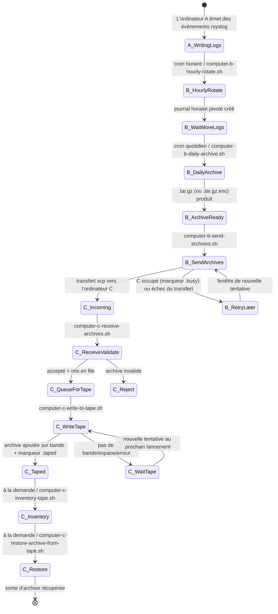
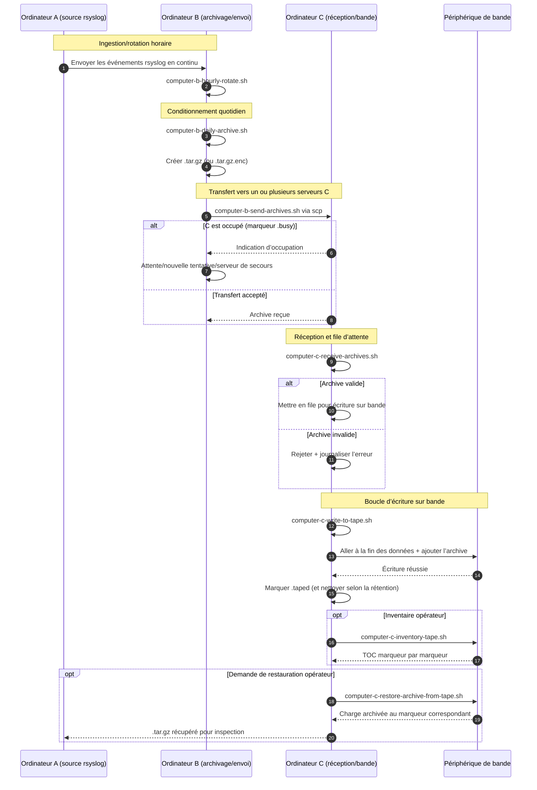

# A/B/C Pipeline Diagrams (Français)

[← README (Français)](../README.fr.md)

Cette copie localisée relie les diagrammes du pipeline au README localisé correspondant.

## Diagramme d’état des événements

## Diagramme de séquence

[← README (Français)](../README.fr.md)
