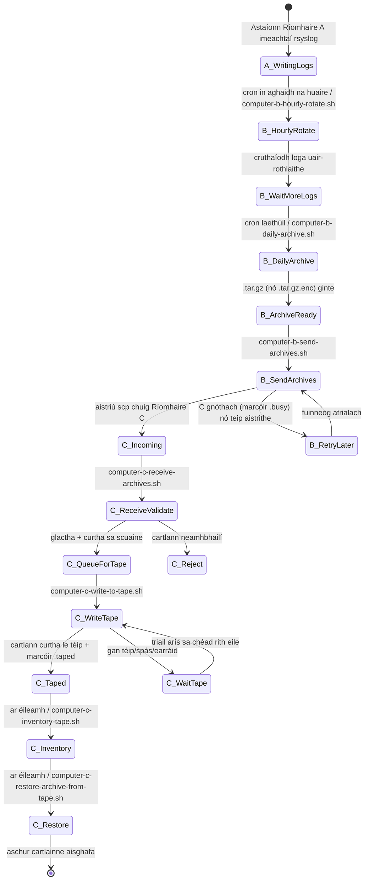
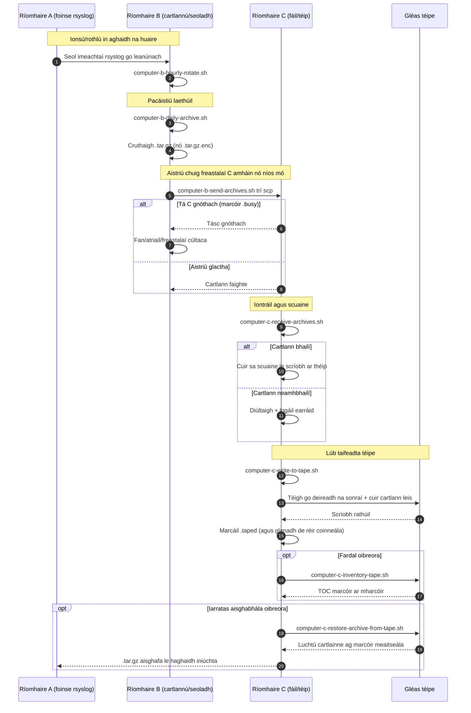

# A/B/C Pipeline Diagrams (Gaeilge)

[← README (Gaeilge)](../README.ga.md)

Nascann an chóip logánaithe seo na léaráidí píblíne leis an README logánaithe comhfhreagrach.

## Léaráid staid imeachtaí

## Léaráid seichimh

[← README (Gaeilge)](../README.ga.md)
