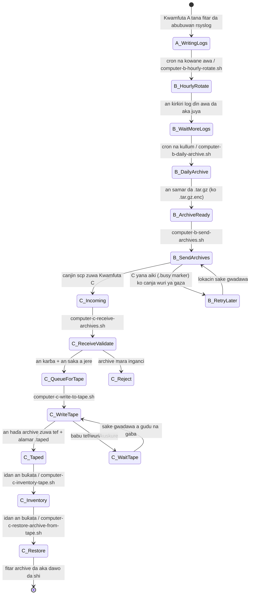
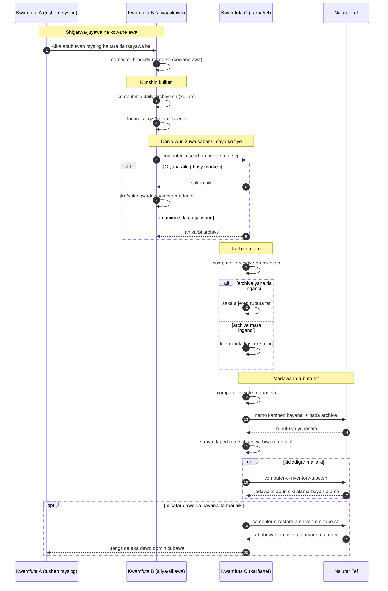

# Zanen Bututun A/B/C (Hausa)

[← README (Hausa)](../README.ha.md)

Wannan kwafin da aka fassara yana haɗa zane-zanen bututun da README ɗin da aka fassara daidai.

## Zanen Yanayin Abubuwan Da Suka Faru

## Zanen Jere

[← README (Hausa)](../README.ha.md)
