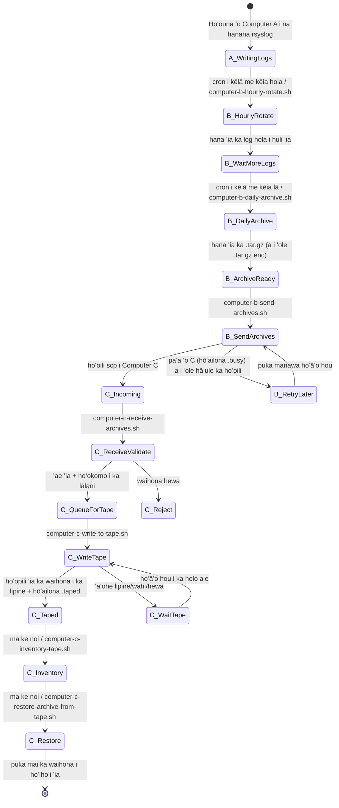
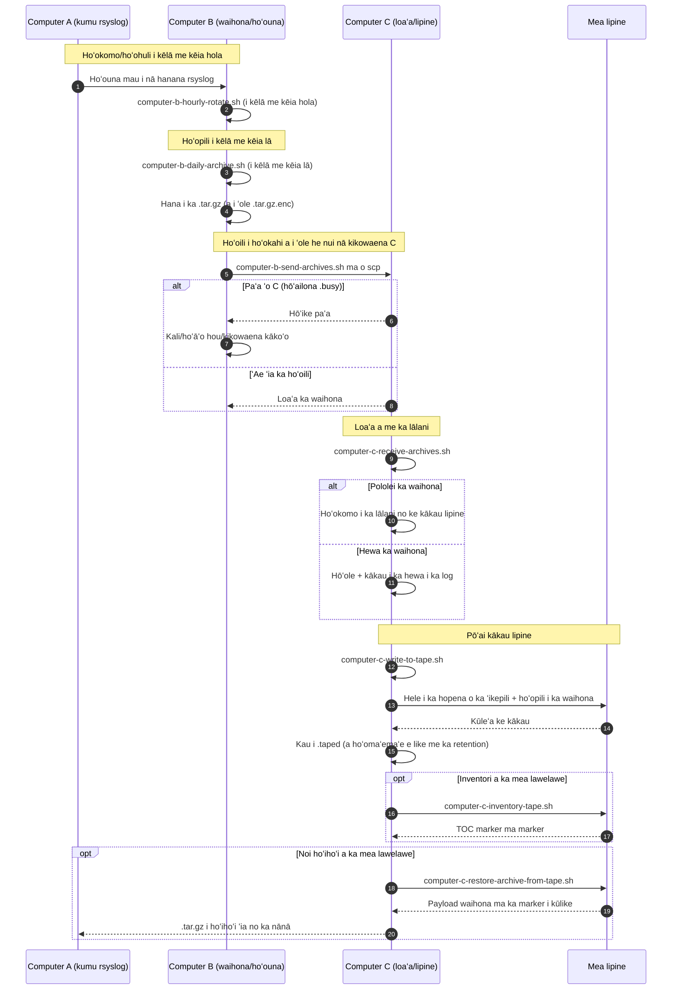

# Nā Kiʻikuhi Paipu A/B/C (ʻŌlelo Hawaiʻi)

[← README (ʻŌlelo Hawaiʻi)](../README.haw.md)

Hoʻohui kēia kope i unuhi ʻia i nā kiʻikuhi paipu me ka README i unuhi like ʻia.

## Kiʻikuhi kūlana hanana

## Kiʻikuhi kaʻina

[← README (ʻŌlelo Hawaiʻi)](../README.haw.md)
