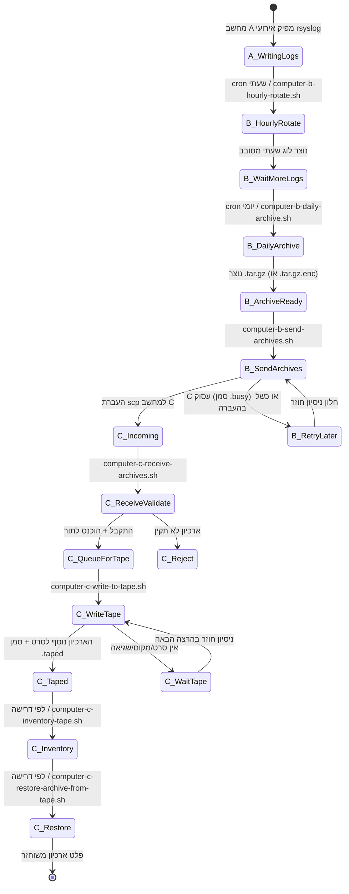
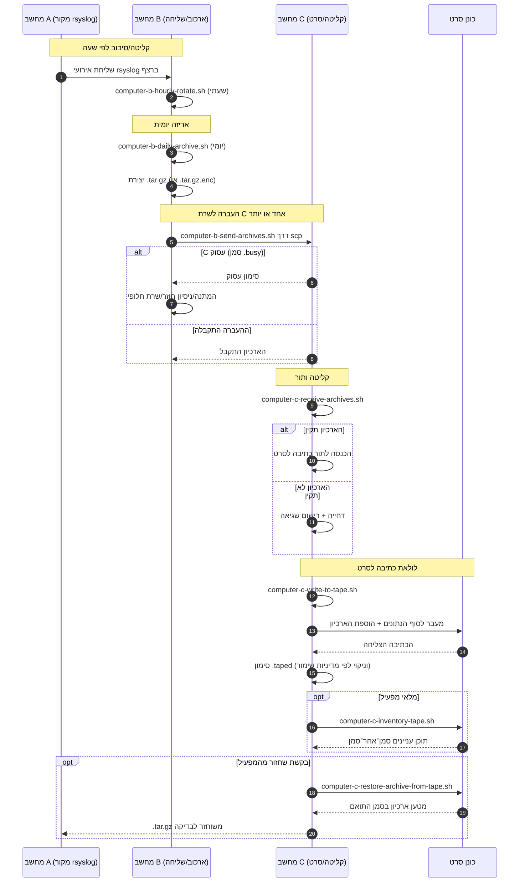

# תרשימי צינור עיבוד A/B/C (עברית)

[← README (עברית)](../README.he.md)

העותק המתורגם הזה מקשר את תרשימי הצינור לקובץ README המתורגם המתאים.

## תרשים מצבי אירועים

## תרשים רצף

[← README (עברית)](../README.he.md)
