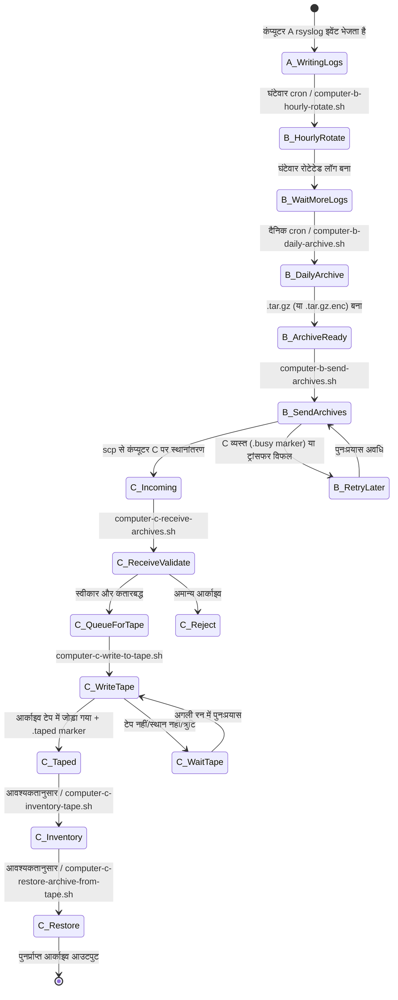
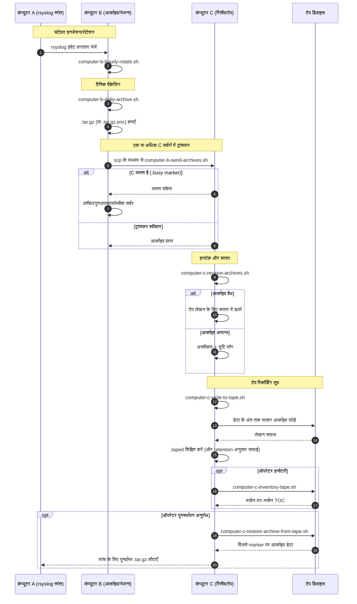

# A/B/C Pipeline Diagrams (हिन्दी)

[← README (हिन्दी)](../README.hi.md)

यह स्थानीयकृत प्रति पाइपलाइन आरेखों को संबंधित स्थानीयकृत README से जोड़ती है।

## इवेंट स्टेट आरेख

## सीक्वेंस आरेख

[← README (हिन्दी)](../README.hi.md)
