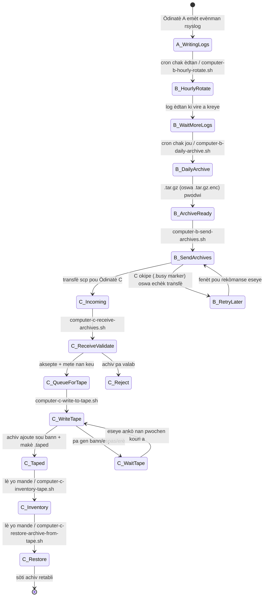
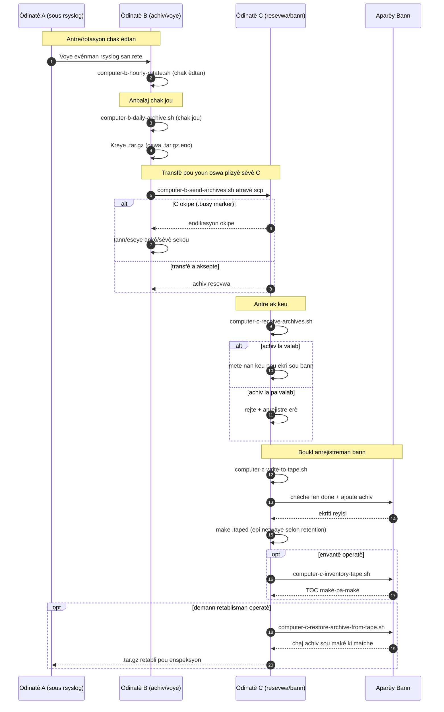

# Dyagram Pipeline A/B/C (Kreyòl Ayisyen)

[← README (Kreyòl Ayisyen)](../README.ht.md)

Kopi lokalize sa a konekte dyagram pipeline yo ak README lokalize ki koresponn lan.

## Dyagram Eta Evènman

## Dyagram Sekans

[← README (Kreyòl Ayisyen)](../README.ht.md)
