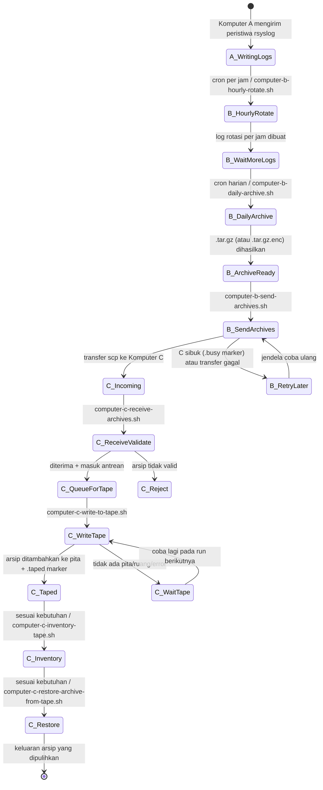
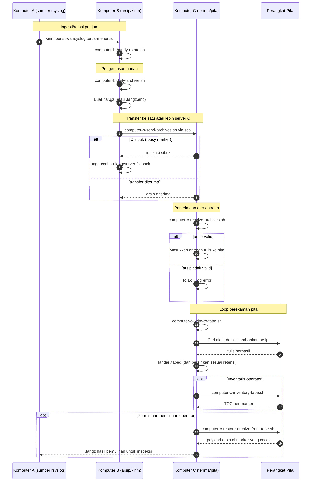

# A/B/C Pipeline Diagrams (Bahasa Indonesia)

[← README (Bahasa Indonesia)](../README.id.md)

Salinan terlokalisasi ini menautkan diagram pipeline ke README terlokalisasi yang sesuai.

## Diagram Status Peristiwa

## Diagram Urutan

[← README (Bahasa Indonesia)](../README.id.md)
