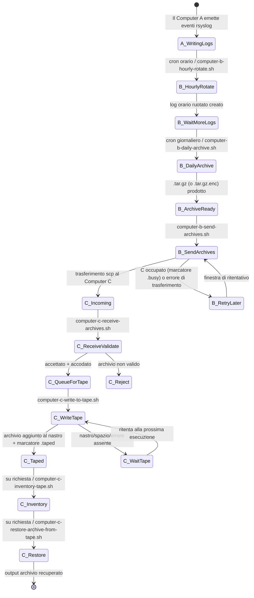
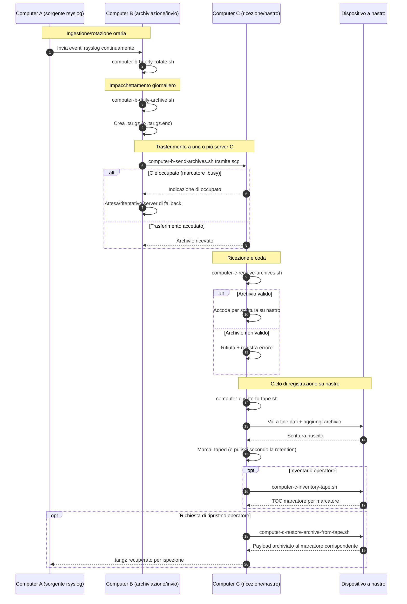

# A/B/C Pipeline Diagrams (Italiano)

[← README (Italiano)](../README.it.md)

Questa copia localizzata collega i diagrammi della pipeline al README localizzato corrispondente.

## Diagramma di stato degli eventi

## Diagramma di sequenza

[← README (Italiano)](../README.it.md)
