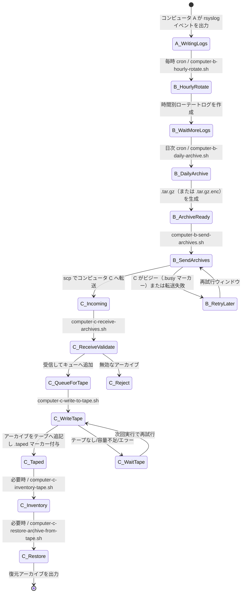
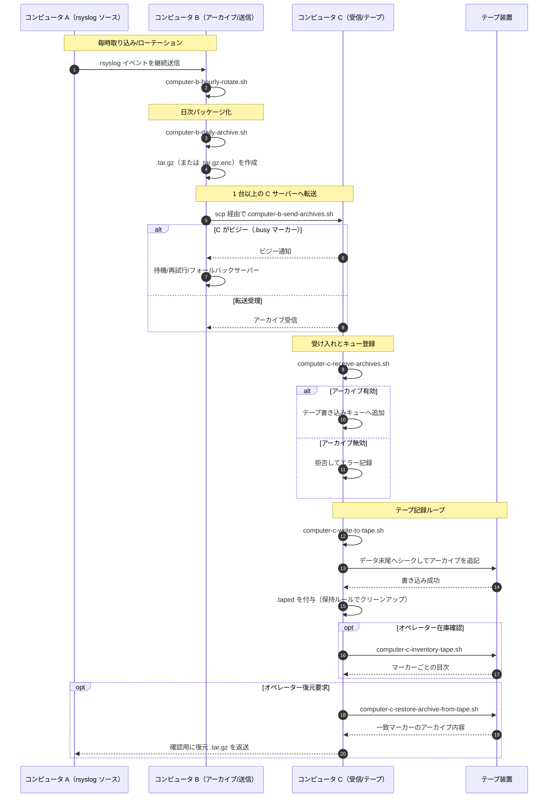

# A/B/C Pipeline Diagrams (日本語)

[← README (日本語)](../README.ja.md)

このローカライズ版は、パイプライン図を対応するローカライズ README にリンクします。

## イベント状態図

```mermaid
stateDiagram-v2
    [*] --> A_WritingLogs : コンピュータ A が rsyslog イベントを出力

    A_WritingLogs --> B_HourlyRotate : 毎時 cron / computer-b-hourly-rotate.sh
    B_HourlyRotate --> B_WaitMoreLogs : 時間別ローテートログを作成
    B_WaitMoreLogs --> B_DailyArchive : 日次 cron / computer-b-daily-archive.sh
    B_DailyArchive --> B_ArchiveReady : .tar.gz（または .tar.gz.enc）を生成

    B_ArchiveReady --> B_SendArchives : computer-b-send-archives.sh
    B_SendArchives --> C_Incoming : scp でコンピュータ C へ転送
    B_SendArchives --> B_RetryLater : C がビジー（.busy マーカー）または転送失敗
    B_RetryLater --> B_SendArchives : 再試行ウィンドウ

    C_Incoming --> C_ReceiveValidate : computer-c-receive-archives.sh
    C_ReceiveValidate --> C_QueueForTape : 受信してキューへ追加
    C_ReceiveValidate --> C_Reject : 無効なアーカイブ

    C_QueueForTape --> C_WriteTape : computer-c-write-to-tape.sh
    C_WriteTape --> C_Taped : アーカイブをテープへ追記し .taped マーカー付与
    C_WriteTape --> C_WaitTape : テープなし/容量不足/エラー
    C_WaitTape --> C_WriteTape : 次回実行で再試行

    C_Taped --> C_Inventory : 必要時 / computer-c-inventory-tape.sh
    C_Inventory --> C_Restore : 必要時 / computer-c-restore-archive-from-tape.sh
    C_Restore --> [*] : 復元アーカイブを出力
```

## シーケンス図

```mermaid
sequenceDiagram
    autonumber
    participant A as コンピュータ A（rsyslog ソース）
    participant B as コンピュータ B（アーカイブ/送信）
    participant C as コンピュータ C（受信/テープ）
    participant T as テープ装置

    Note over A,B: 毎時取り込み/ローテーション
    A->>B: rsyslog イベントを継続送信
    B->>B: computer-b-hourly-rotate.sh

    Note over B: 日次パッケージ化
    B->>B: computer-b-daily-archive.sh
    B->>B: .tar.gz（または .tar.gz.enc）を作成

    Note over B,C: 1 台以上の C サーバーへ転送
    B->>C: scp 経由で computer-b-send-archives.sh
    alt C がビジー（.busy マーカー）
        C-->>B: ビジー通知
        B->>B: 待機/再試行/フォールバックサーバー
    else 転送受理
        C-->>B: アーカイブ受信
    end

    Note over C: 受け入れとキュー登録
    C->>C: computer-c-receive-archives.sh
    alt アーカイブ有効
        C->>C: テープ書き込みキューへ追加
    else アーカイブ無効
        C->>C: 拒否してエラー記録
    end

    Note over C,T: テープ記録ループ
    C->>C: computer-c-write-to-tape.sh
    C->>T: データ末尾へシークしてアーカイブを追記
    T-->>C: 書き込み成功
    C->>C: .taped を付与（保持ルールでクリーンアップ）

    opt オペレーター在庫確認
        C->>T: computer-c-inventory-tape.sh
        T-->>C: マーカーごとの目次
    end

    opt オペレーター復元要求
        C->>T: computer-c-restore-archive-from-tape.sh
        T-->>C: 一致マーカーのアーカイブ内容
        C-->>A: 確認用に復元 .tar.gz を返送
    end
```

[← README (日本語)](../README.ja.md)
