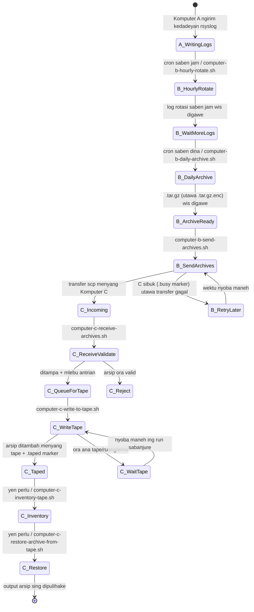
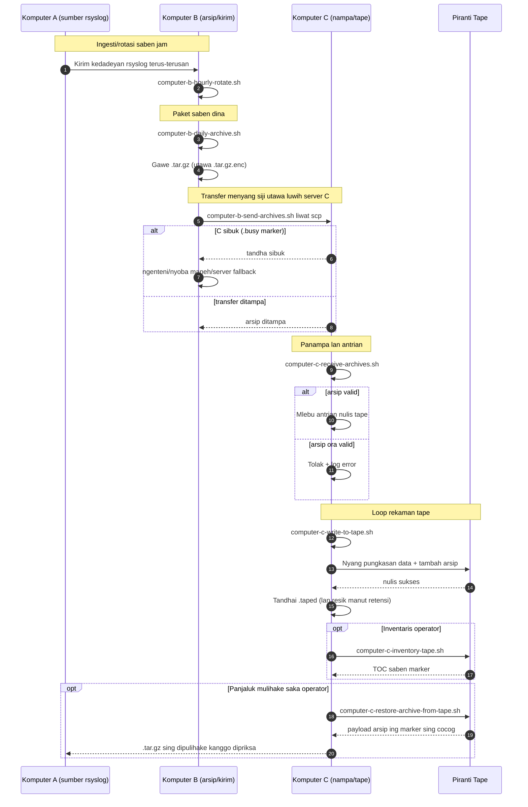

# A/B/C Pipeline Diagrams (Basa Jawa)

[← README (Basa Jawa)](../README.jv.md)

Salinan terlokalisasi iki nyambungake diagram pipeline menyang README terlokalisasi sing cocog.

## Diagram Status Kedadeyan

## Diagram Urutan

[← README (Basa Jawa)](../README.jv.md)
