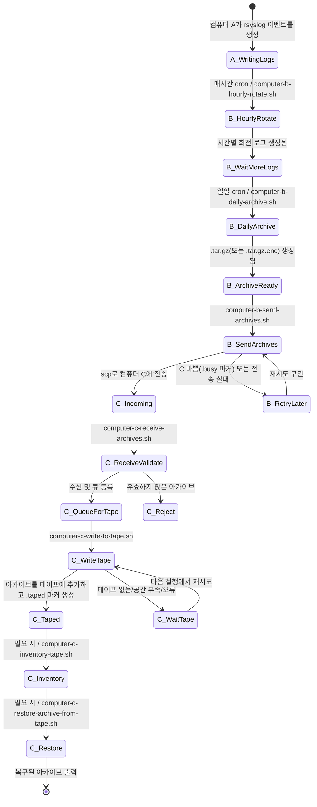
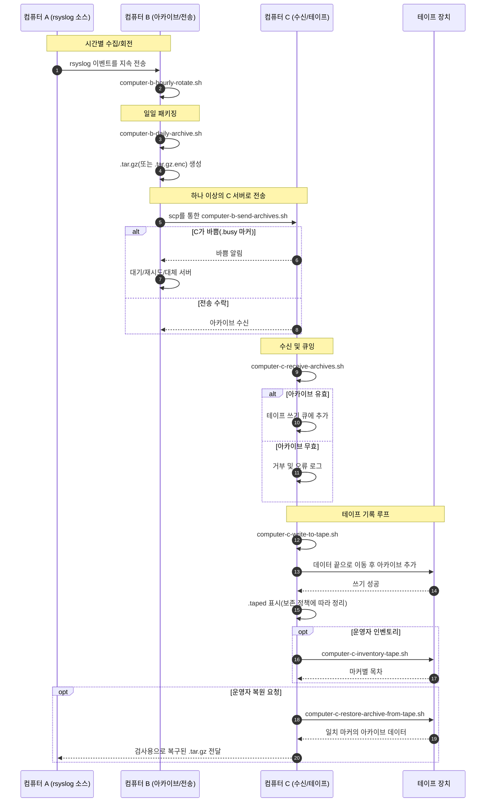

# A/B/C Pipeline Diagrams (한국어)

[← README (한국어)](../README.ko.md)

이 현지화본은 파이프라인 다이어그램을 해당 현지화 README와 연결합니다.

## 이벤트 상태 다이어그램

```mermaid
stateDiagram-v2
    [*] --> A_WritingLogs : 컴퓨터 A가 rsyslog 이벤트를 생성

    A_WritingLogs --> B_HourlyRotate : 매시간 cron / computer-b-hourly-rotate.sh
    B_HourlyRotate --> B_WaitMoreLogs : 시간별 회전 로그 생성됨
    B_WaitMoreLogs --> B_DailyArchive : 일일 cron / computer-b-daily-archive.sh
    B_DailyArchive --> B_ArchiveReady : .tar.gz(또는 .tar.gz.enc) 생성됨

    B_ArchiveReady --> B_SendArchives : computer-b-send-archives.sh
    B_SendArchives --> C_Incoming : scp로 컴퓨터 C에 전송
    B_SendArchives --> B_RetryLater : C 바쁨(.busy 마커) 또는 전송 실패
    B_RetryLater --> B_SendArchives : 재시도 구간

    C_Incoming --> C_ReceiveValidate : computer-c-receive-archives.sh
    C_ReceiveValidate --> C_QueueForTape : 수신 및 큐 등록
    C_ReceiveValidate --> C_Reject : 유효하지 않은 아카이브

    C_QueueForTape --> C_WriteTape : computer-c-write-to-tape.sh
    C_WriteTape --> C_Taped : 아카이브를 테이프에 추가하고 .taped 마커 생성
    C_WriteTape --> C_WaitTape : 테이프 없음/공간 부족/오류
    C_WaitTape --> C_WriteTape : 다음 실행에서 재시도

    C_Taped --> C_Inventory : 필요 시 / computer-c-inventory-tape.sh
    C_Inventory --> C_Restore : 필요 시 / computer-c-restore-archive-from-tape.sh
    C_Restore --> [*] : 복구된 아카이브 출력
```

## 시퀀스 다이어그램

```mermaid
sequenceDiagram
    autonumber
    participant A as 컴퓨터 A (rsyslog 소스)
    participant B as 컴퓨터 B (아카이브/전송)
    participant C as 컴퓨터 C (수신/테이프)
    participant T as 테이프 장치

    Note over A,B: 시간별 수집/회전
    A->>B: rsyslog 이벤트를 지속 전송
    B->>B: computer-b-hourly-rotate.sh

    Note over B: 일일 패키징
    B->>B: computer-b-daily-archive.sh
    B->>B: .tar.gz(또는 .tar.gz.enc) 생성

    Note over B,C: 하나 이상의 C 서버로 전송
    B->>C: scp를 통한 computer-b-send-archives.sh
    alt C가 바쁨(.busy 마커)
        C-->>B: 바쁨 알림
        B->>B: 대기/재시도/대체 서버
    else 전송 수락
        C-->>B: 아카이브 수신
    end

    Note over C: 수신 및 큐잉
    C->>C: computer-c-receive-archives.sh
    alt 아카이브 유효
        C->>C: 테이프 쓰기 큐에 추가
    else 아카이브 무효
        C->>C: 거부 및 오류 로그
    end

    Note over C,T: 테이프 기록 루프
    C->>C: computer-c-write-to-tape.sh
    C->>T: 데이터 끝으로 이동 후 아카이브 추가
    T-->>C: 쓰기 성공
    C->>C: .taped 표시(보존 정책에 따라 정리)

    opt 운영자 인벤토리
        C->>T: computer-c-inventory-tape.sh
        T-->>C: 마커별 목차
    end

    opt 운영자 복원 요청
        C->>T: computer-c-restore-archive-from-tape.sh
        T-->>C: 일치 마커의 아카이브 데이터
        C-->>A: 검사용으로 복구된 .tar.gz 전달
    end
```

[← README (한국어)](../README.ko.md)
