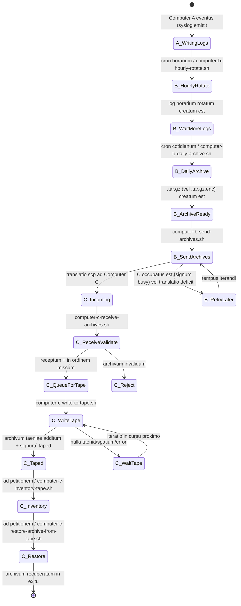
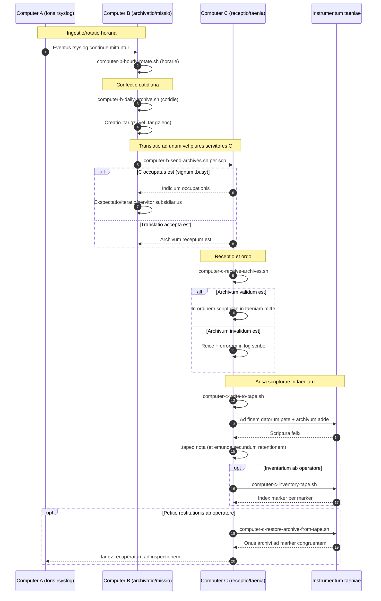

# Diagrammata cursus A/B/C (Latina)

[← README (Latina)](../README.la.md)

Hoc exemplar locale diagrammata cursus cum README locali respondenti coniungit.

## Diagramma status eventuum

## Diagramma ordinis

[← README (Latina)](../README.la.md)
