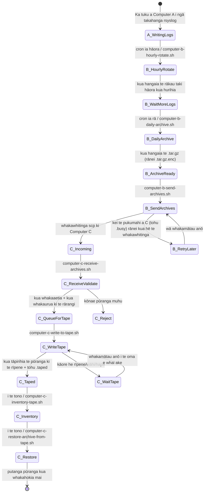
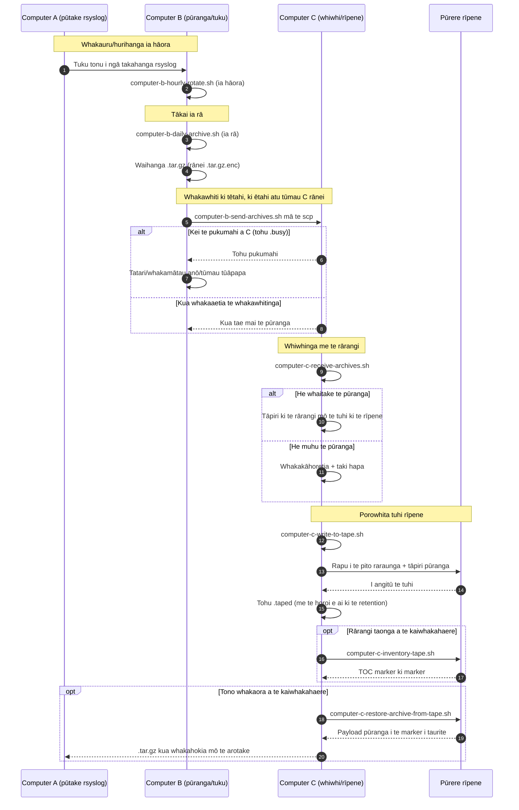

# Ngā hoahoa paipa A/B/C (Te Reo Māori)

[← README (Te Reo Māori)](../README.mi.md)

Ka hono tēnei kape kua whakamāoritia i ngā hoahoa paipa ki te README kua whakamāoritia e hāngai ana.

## Hoahoa āhua takahanga

## Hoahoa raupapa

[← README (Te Reo Māori)](../README.mi.md)
