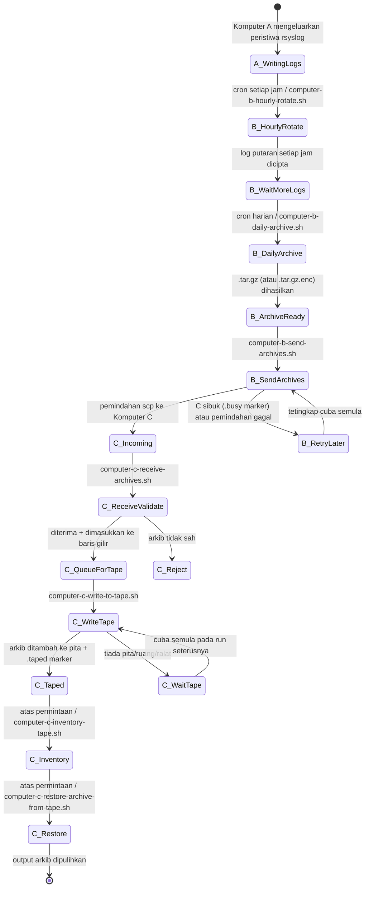
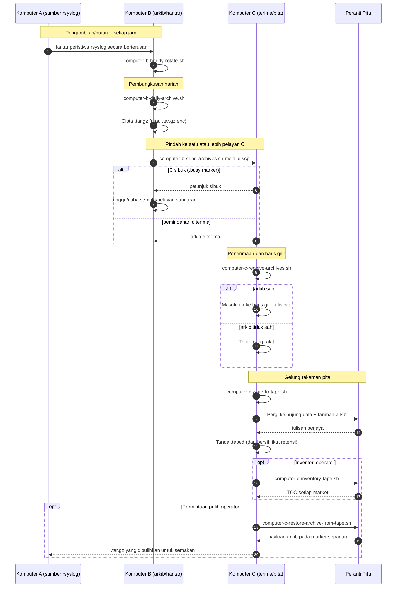

# A/B/C Pipeline Diagrams (Bahasa Melayu)

[← README (Bahasa Melayu)](../README.ms.md)

Salinan setempat ini memautkan rajah pipeline kepada README setempat yang sepadan.

## Rajah Keadaan Peristiwa

## Rajah Urutan

[← README (Bahasa Melayu)](../README.ms.md)
