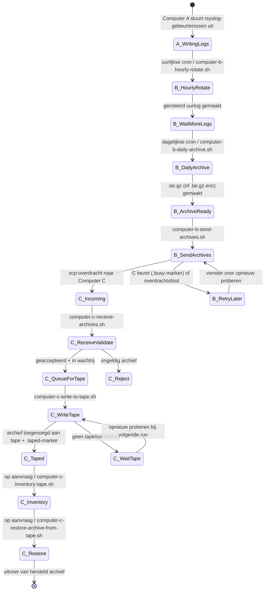
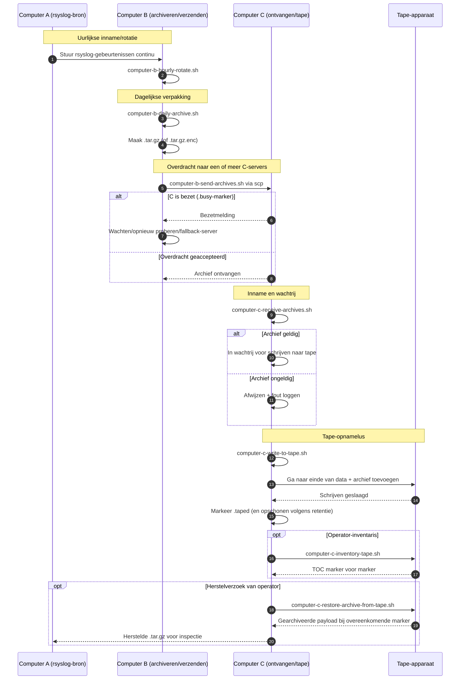

# A/B/C Pipeline Diagrams (Nederlands)

[← README (Nederlands)](../README.nl.md)

Deze gelokaliseerde kopie koppelt de pijplijndiagrammen aan de bijbehorende gelokaliseerde README.

## Gebeurtenis-statusdiagram

## Sequentiediagram

[← README (Nederlands)](../README.nl.md)
