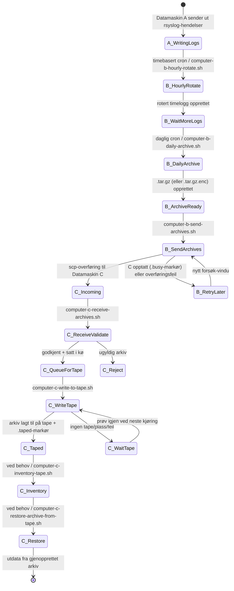
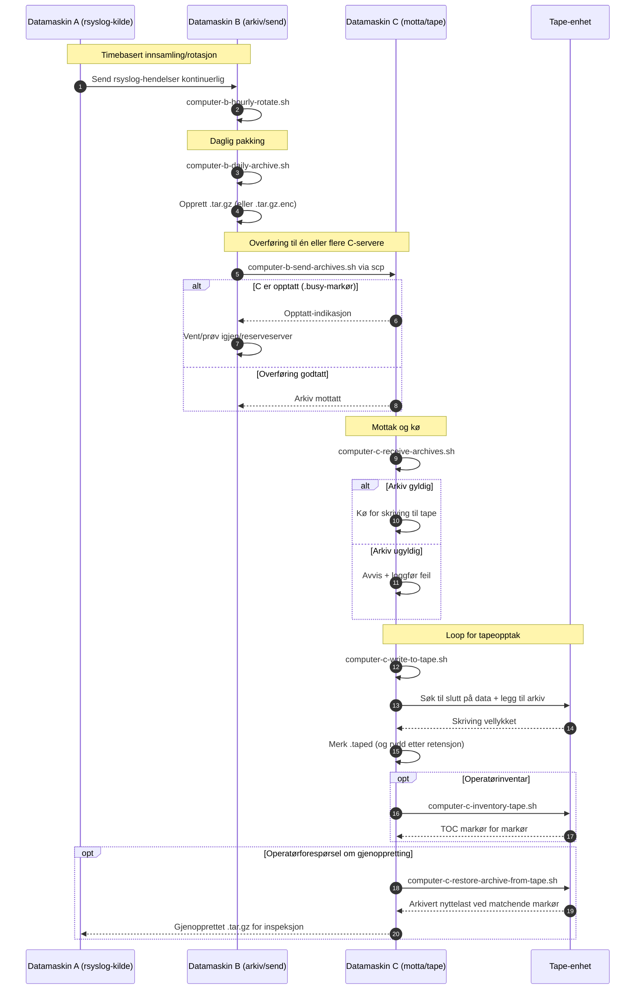

# A/B/C Pipeline Diagrams (Norsk)

[← README (Norsk)](../README.no.md)

Denne lokaliserte kopien kobler pipeline-diagrammene til den tilsvarende lokaliserte README-en.

## Hendelses-tilstandsdiagram

## Sekvensdiagram

[← README (Norsk)](../README.no.md)
