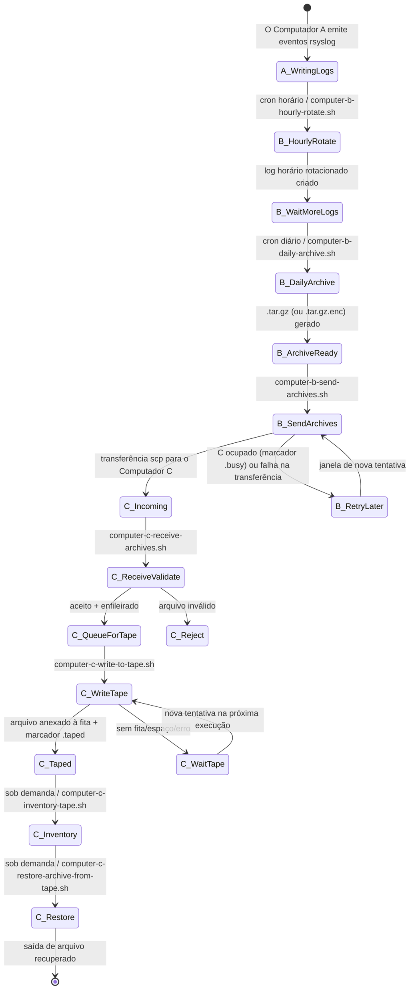
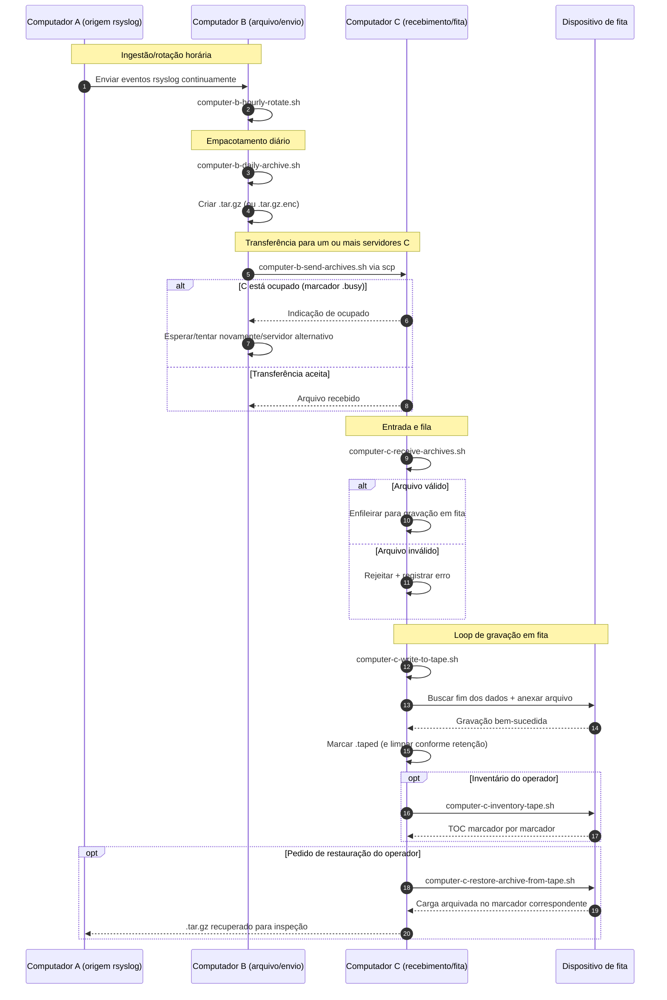

# A/B/C Pipeline Diagrams (Português)

[← README (Português)](../README.pt.md)

Esta cópia localizada liga os diagramas do pipeline ao README localizado correspondente.

## Diagrama de estados de eventos

## Diagrama de sequência

[← README (Português)](../README.pt.md)
