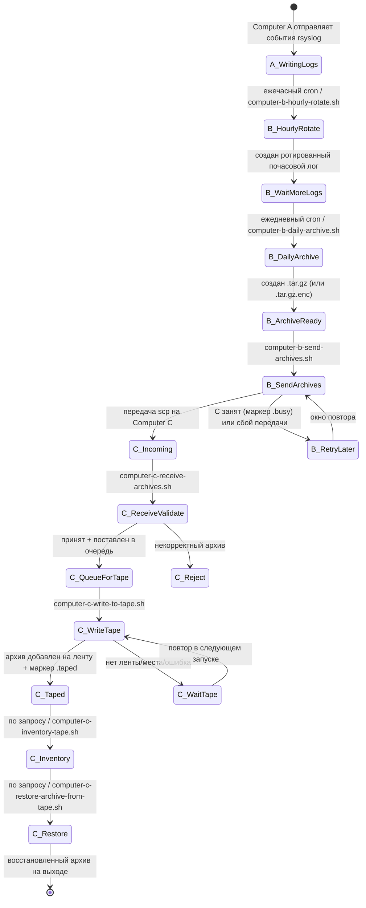
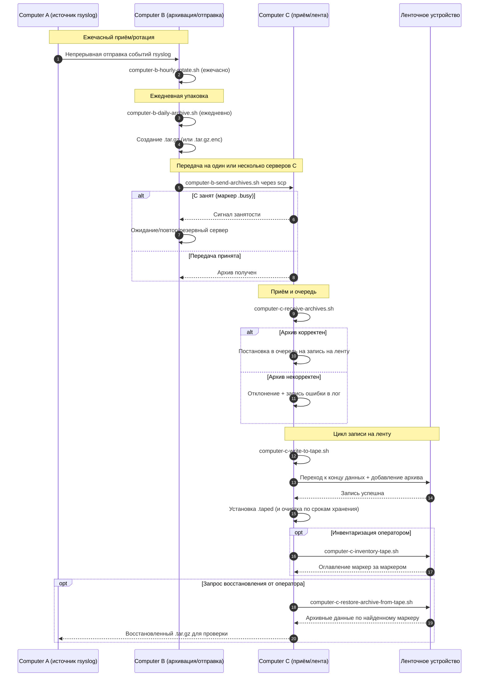

# Диаграммы конвейера A/B/C (Русский)

[← README (Русский)](../README.ru.md)

Эта локализованная копия связывает диаграммы конвейера с соответствующим локализованным README.

## Диаграмма состояний событий

## Диаграмма последовательности

[← README (Русский)](../README.ru.md)
