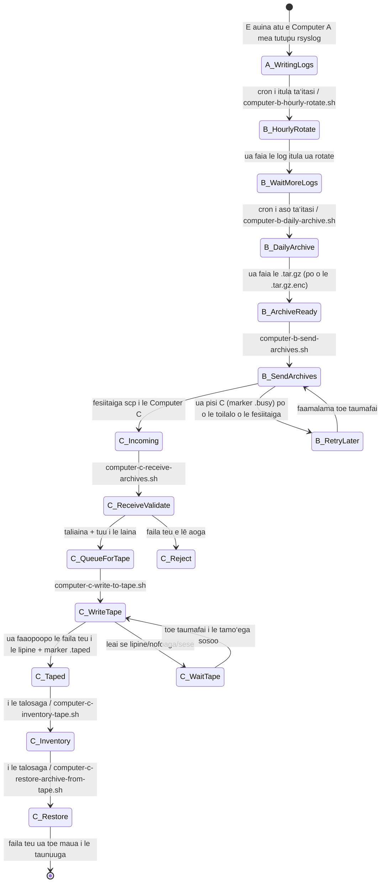
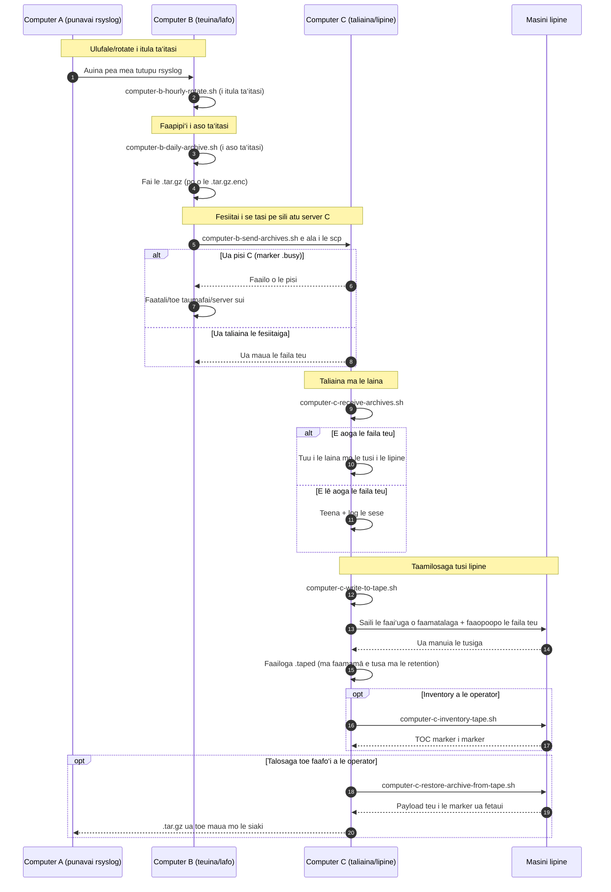

# Ata o le paipa A/B/C (Gagana Samoa)

[← README (Gagana Samoa)](../README.sm.md)

E fesoʻotaʻi e lenei kopi ua faaliliuina ata o le paipa ma le README ua faaliliuina e fetaui.

## Ata o tulaga o mea tutupu

## Ata o le faasologa

[← README (Gagana Samoa)](../README.sm.md)
