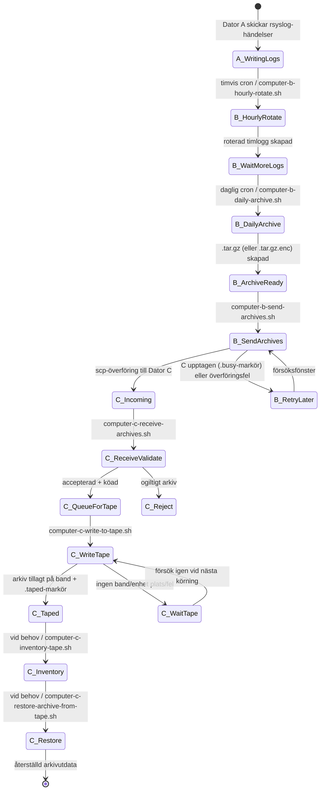
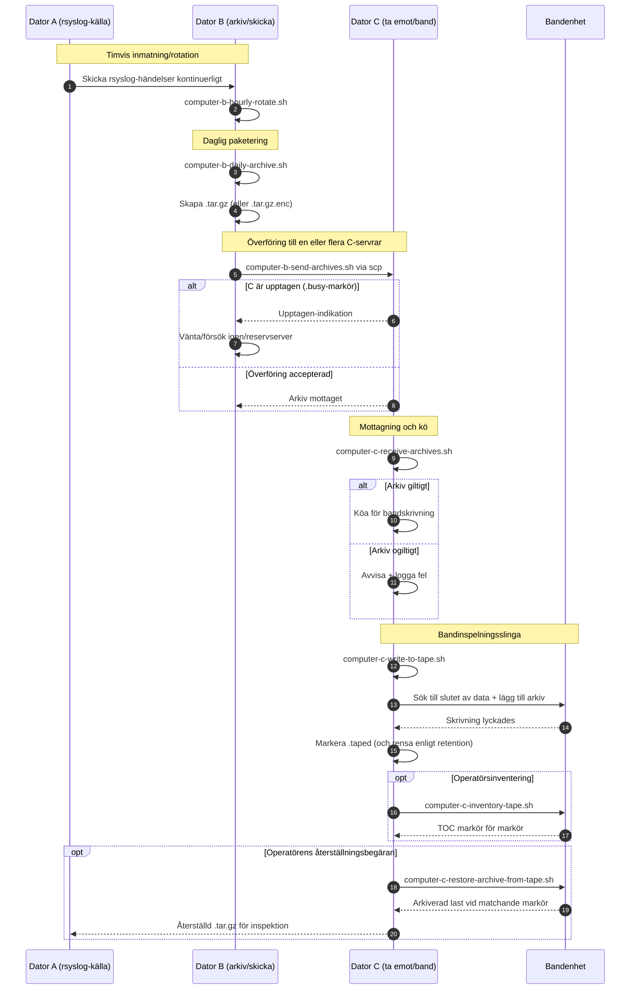

# A/B/C Pipeline Diagrams (Svenska)

[← README (Svenska)](../README.sv.md)

Den här lokaliserade kopian länkar pipeline-diagrammen till motsvarande lokaliserade README.

## Tillståndsdiagram för händelser

## Sekvensdiagram

[← README (Svenska)](../README.sv.md)
