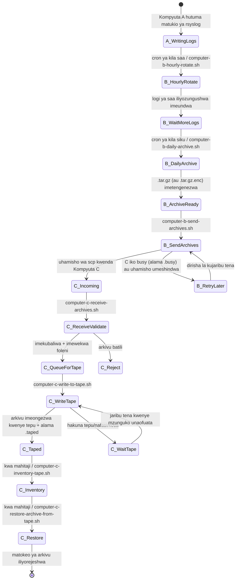
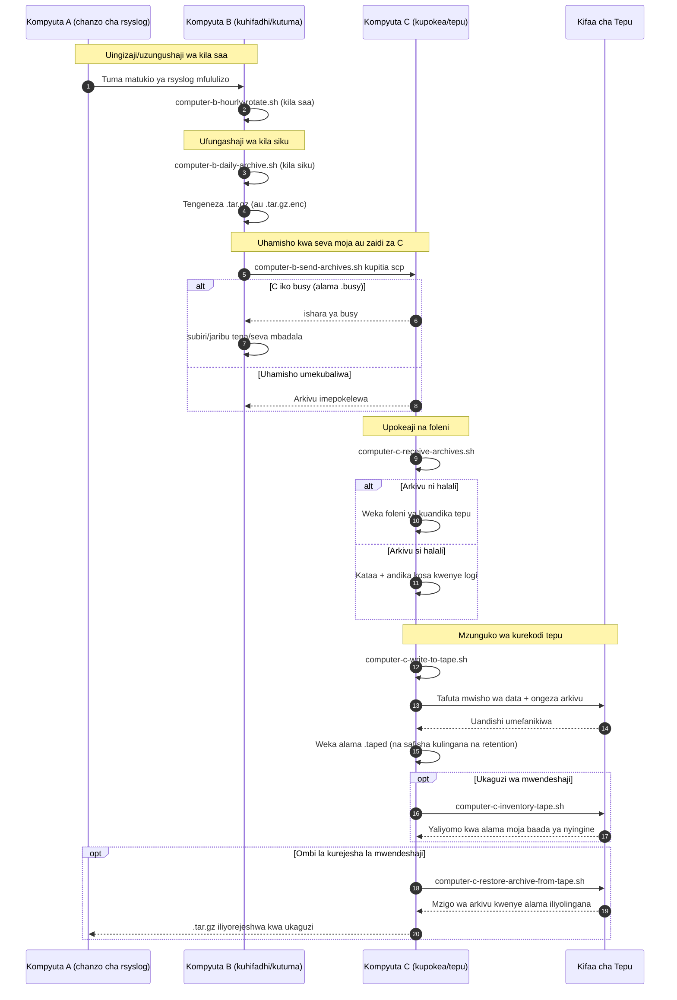

# Michoro ya Mlolongo wa A/B/C (Kiswahili)

[← README (Kiswahili)](../README.sw.md)

Nakala hii iliyotafsiriwa inaunganisha michoro ya mlolongo na README iliyotafsiriwa inayolingana.

## Mchoro wa Hali za Matukio

## Mchoro wa Mfuatano

[← README (Kiswahili)](../README.sw.md)
