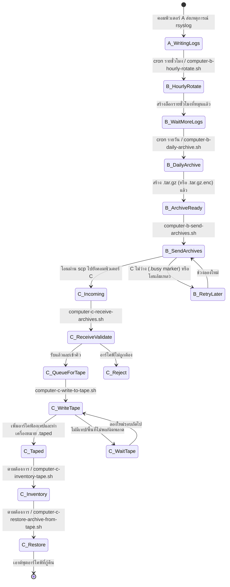
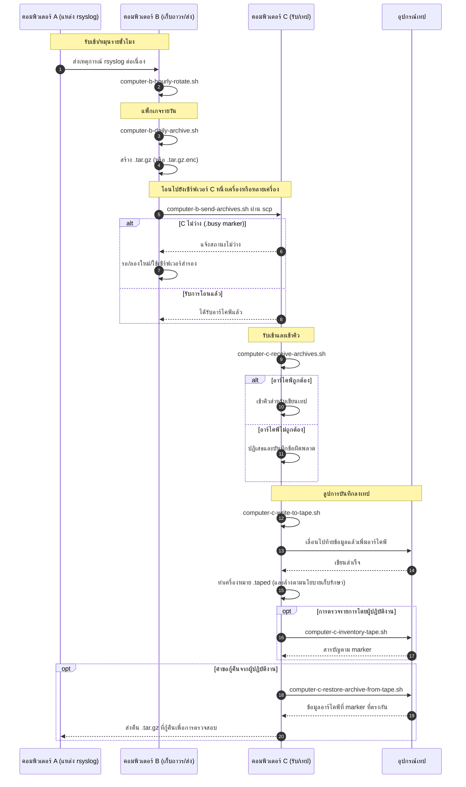

# A/B/C Pipeline Diagrams (ไทย)

[← README (ไทย)](../README.th.md)

ฉบับแปลนี้เชื่อมแผนภาพไปป์ไลน์กับ README ฉบับแปลที่สอดคล้องกัน

## แผนภาพสถานะเหตุการณ์

## แผนภาพลำดับ

[← README (ไทย)](../README.th.md)
