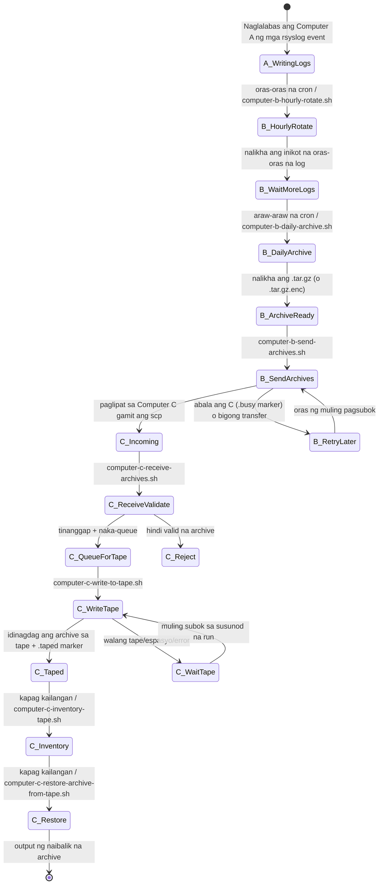
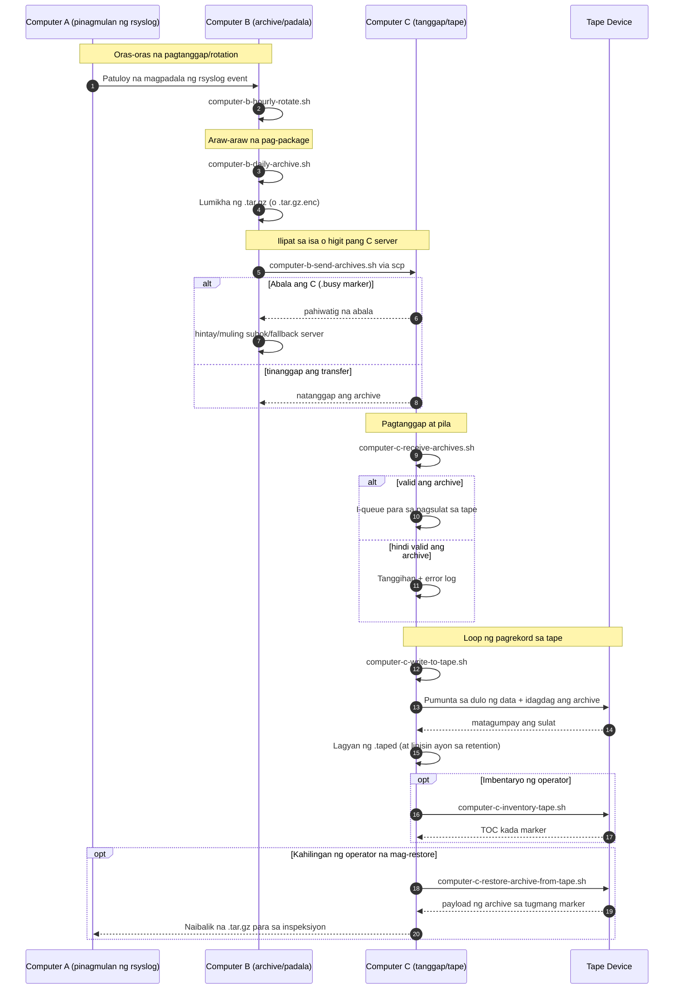

# A/B/C Pipeline Diagrams (Tagalog)

[← README (Tagalog)](../README.tl.md)

Iniuugnay ng lokalisadong kopyang ito ang mga diagram ng pipeline sa katugmang lokalisadong README.

## Diagram ng Estado ng Kaganapan

## Diagram ng Pagkakasunod-sunod

[← README (Tagalog)](../README.tl.md)
