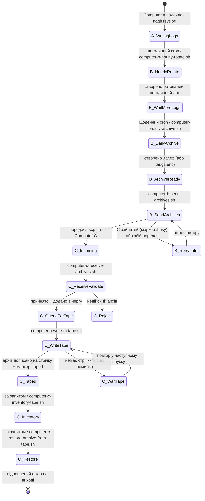
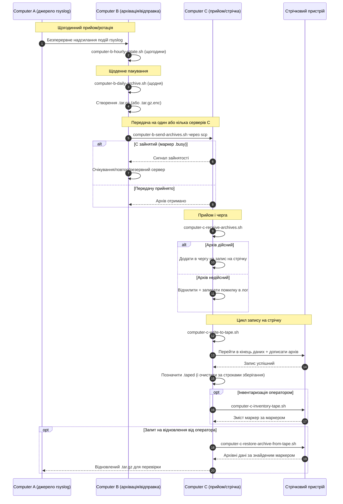

# Діаграми конвеєра A/B/C (Українська)

[← README (Українська)](../README.uk.md)

Ця локалізована копія пов’язує діаграми конвеєра з відповідним локалізованим README.

## Діаграма станів подій

## Діаграма послідовності

[← README (Українська)](../README.uk.md)
