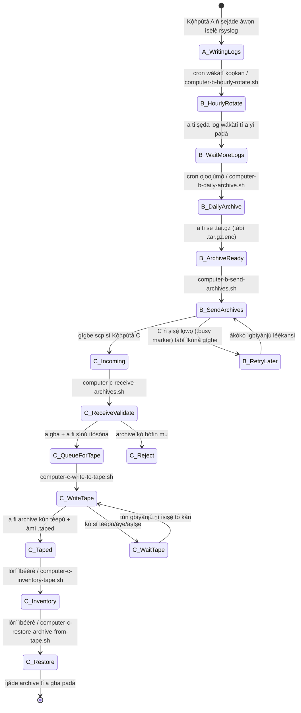
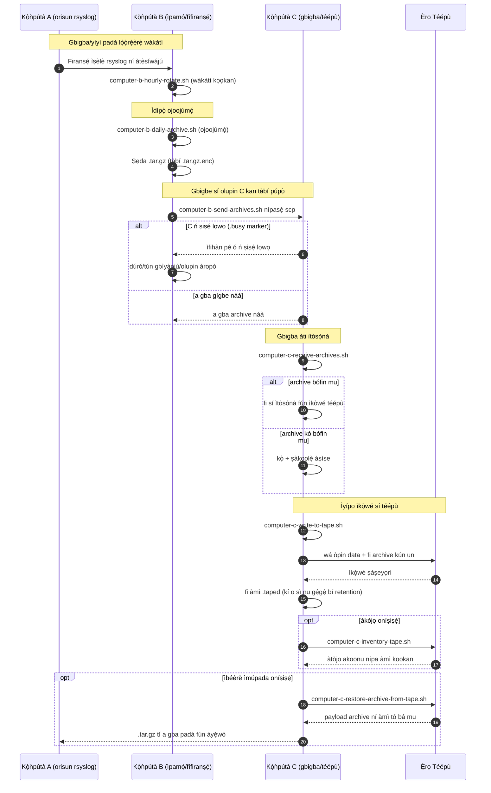

# Àwòrán Ilana A/B/C (Yorùbá)

[← README (Yorùbá)](../README.yo.md)

Ẹ̀dà ìtúmọ̀ yìí so àwọn àwòrán ilana pọ̀ mọ README ìtúmọ̀ tó bá a mu.

## Àwòrán Ìpò Ìṣẹ̀lẹ̀

## Àwòrán Àtẹ̀lé

[← README (Yorùbá)](../README.yo.md)
