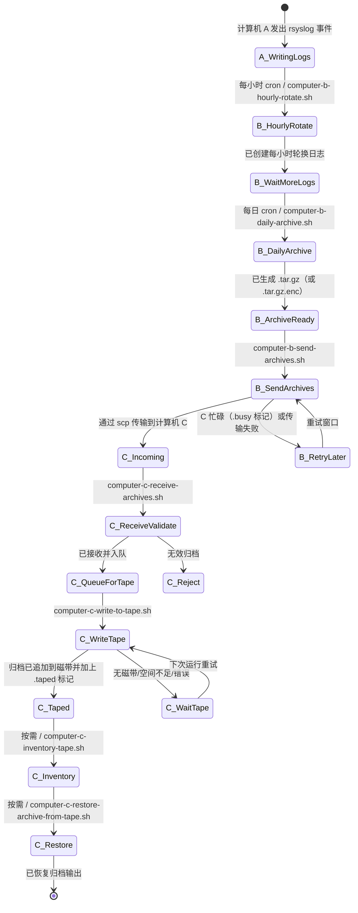
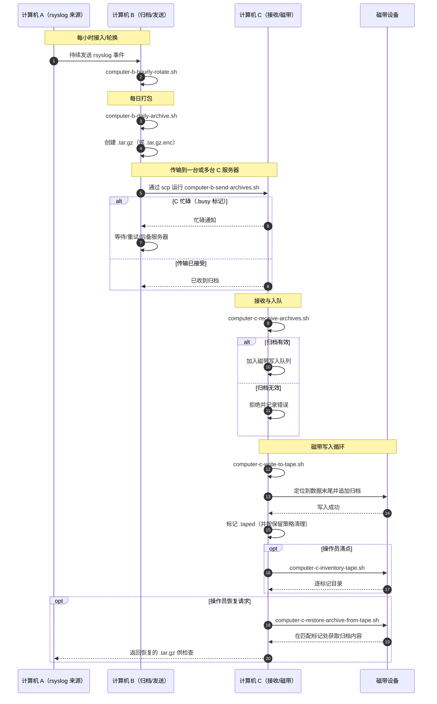

# A/B/C Pipeline Diagrams (简体中文)

[← README (简体中文)](../README.zh-CN.md)

此本地化版本将流水线图链接到对应的本地化 README。

## 事件状态图

```mermaid
stateDiagram-v2
    [*] --> A_WritingLogs : 计算机 A 发出 rsyslog 事件

    A_WritingLogs --> B_HourlyRotate : 每小时 cron / computer-b-hourly-rotate.sh
    B_HourlyRotate --> B_WaitMoreLogs : 已创建每小时轮换日志
    B_WaitMoreLogs --> B_DailyArchive : 每日 cron / computer-b-daily-archive.sh
    B_DailyArchive --> B_ArchiveReady : 已生成 .tar.gz（或 .tar.gz.enc）

    B_ArchiveReady --> B_SendArchives : computer-b-send-archives.sh
    B_SendArchives --> C_Incoming : 通过 scp 传输到计算机 C
    B_SendArchives --> B_RetryLater : C 忙碌（.busy 标记）或传输失败
    B_RetryLater --> B_SendArchives : 重试窗口

    C_Incoming --> C_ReceiveValidate : computer-c-receive-archives.sh
    C_ReceiveValidate --> C_QueueForTape : 已接收并入队
    C_ReceiveValidate --> C_Reject : 无效归档

    C_QueueForTape --> C_WriteTape : computer-c-write-to-tape.sh
    C_WriteTape --> C_Taped : 归档已追加到磁带并加上 .taped 标记
    C_WriteTape --> C_WaitTape : 无磁带/空间不足/错误
    C_WaitTape --> C_WriteTape : 下次运行重试

    C_Taped --> C_Inventory : 按需 / computer-c-inventory-tape.sh
    C_Inventory --> C_Restore : 按需 / computer-c-restore-archive-from-tape.sh
    C_Restore --> [*] : 已恢复归档输出
```

## 时序图

```mermaid
sequenceDiagram
    autonumber
    participant A as 计算机 A（rsyslog 来源）
    participant B as 计算机 B（归档/发送）
    participant C as 计算机 C（接收/磁带）
    participant T as 磁带设备

    Note over A,B: 每小时接入/轮换
    A->>B: 持续发送 rsyslog 事件
    B->>B: computer-b-hourly-rotate.sh

    Note over B: 每日打包
    B->>B: computer-b-daily-archive.sh
    B->>B: 创建 .tar.gz（或 .tar.gz.enc）

    Note over B,C: 传输到一台或多台 C 服务器
    B->>C: 通过 scp 运行 computer-b-send-archives.sh
    alt C 忙碌（.busy 标记）
        C-->>B: 忙碌通知
        B->>B: 等待/重试/后备服务器
    else 传输已接受
        C-->>B: 已收到归档
    end

    Note over C: 接收与入队
    C->>C: computer-c-receive-archives.sh
    alt 归档有效
        C->>C: 加入磁带写入队列
    else 归档无效
        C->>C: 拒绝并记录错误
    end

    Note over C,T: 磁带写入循环
    C->>C: computer-c-write-to-tape.sh
    C->>T: 定位到数据末尾并追加归档
    T-->>C: 写入成功
    C->>C: 标记 .taped（并按保留策略清理）

    opt 操作员清点
        C->>T: computer-c-inventory-tape.sh
        T-->>C: 逐标记目录
    end

    opt 操作员恢复请求
        C->>T: computer-c-restore-archive-from-tape.sh
        T-->>C: 在匹配标记处获取归档内容
        C-->>A: 返回恢复的 .tar.gz 供检查
    end
```

[← README (简体中文)](../README.zh-CN.md)
