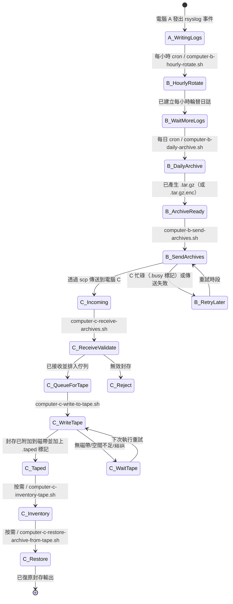
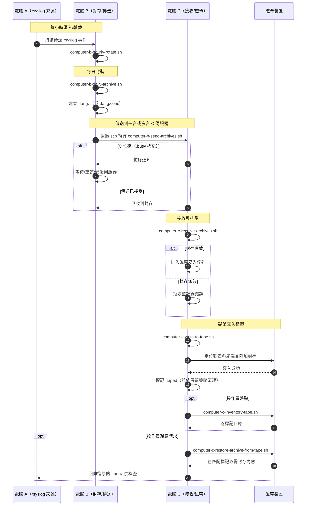

# A/B/C Pipeline Diagrams (繁體中文（香港）)

[← README (繁體中文（香港）)](../README.zh-HK.md)

此本地化版本將管線圖連結到對應的本地化 README。

## 事件狀態圖

```mermaid
stateDiagram-v2
    [*] --> A_WritingLogs : 電腦 A 發出 rsyslog 事件

    A_WritingLogs --> B_HourlyRotate : 每小時 cron / computer-b-hourly-rotate.sh
    B_HourlyRotate --> B_WaitMoreLogs : 已建立每小時輪替日誌
    B_WaitMoreLogs --> B_DailyArchive : 每日 cron / computer-b-daily-archive.sh
    B_DailyArchive --> B_ArchiveReady : 已產生 .tar.gz（或 .tar.gz.enc）

    B_ArchiveReady --> B_SendArchives : computer-b-send-archives.sh
    B_SendArchives --> C_Incoming : 透過 scp 傳送到電腦 C
    B_SendArchives --> B_RetryLater : C 忙碌（.busy 標記）或傳送失敗
    B_RetryLater --> B_SendArchives : 重試時段

    C_Incoming --> C_ReceiveValidate : computer-c-receive-archives.sh
    C_ReceiveValidate --> C_QueueForTape : 已接收並排入佇列
    C_ReceiveValidate --> C_Reject : 無效封存

    C_QueueForTape --> C_WriteTape : computer-c-write-to-tape.sh
    C_WriteTape --> C_Taped : 封存已附加到磁帶並加上 .taped 標記
    C_WriteTape --> C_WaitTape : 無磁帶/空間不足/錯誤
    C_WaitTape --> C_WriteTape : 下次執行重試

    C_Taped --> C_Inventory : 按需 / computer-c-inventory-tape.sh
    C_Inventory --> C_Restore : 按需 / computer-c-restore-archive-from-tape.sh
    C_Restore --> [*] : 已復原封存輸出
```

## 序列圖

```mermaid
sequenceDiagram
    autonumber
    participant A as 電腦 A（rsyslog 來源）
    participant B as 電腦 B（封存/傳送）
    participant C as 電腦 C（接收/磁帶）
    participant T as 磁帶裝置

    Note over A,B: 每小時匯入/輪替
    A->>B: 持續傳送 rsyslog 事件
    B->>B: computer-b-hourly-rotate.sh

    Note over B: 每日封裝
    B->>B: computer-b-daily-archive.sh
    B->>B: 建立 .tar.gz（或 .tar.gz.enc）

    Note over B,C: 傳送到一台或多台 C 伺服器
    B->>C: 透過 scp 執行 computer-b-send-archives.sh
    alt C 忙碌（.busy 標記）
        C-->>B: 忙碌通知
        B->>B: 等待/重試/備援伺服器
    else 傳送已接受
        C-->>B: 已收到封存
    end

    Note over C: 接收與排隊
    C->>C: computer-c-receive-archives.sh
    alt 封存有效
        C->>C: 排入磁帶寫入佇列
    else 封存無效
        C->>C: 拒收並記錄錯誤
    end

    Note over C,T: 磁帶寫入循環
    C->>C: computer-c-write-to-tape.sh
    C->>T: 定位到資料尾端並附加封存
    T-->>C: 寫入成功
    C->>C: 標記 .taped（並依保留策略清理）

    opt 操作員盤點
        C->>T: computer-c-inventory-tape.sh
        T-->>C: 逐標記目錄
    end

    opt 操作員還原請求
        C->>T: computer-c-restore-archive-from-tape.sh
        T-->>C: 在匹配標記取得封存內容
        C-->>A: 回傳復原的 .tar.gz 供檢查
    end
```

[← README (繁體中文（香港）)](../README.zh-HK.md)
